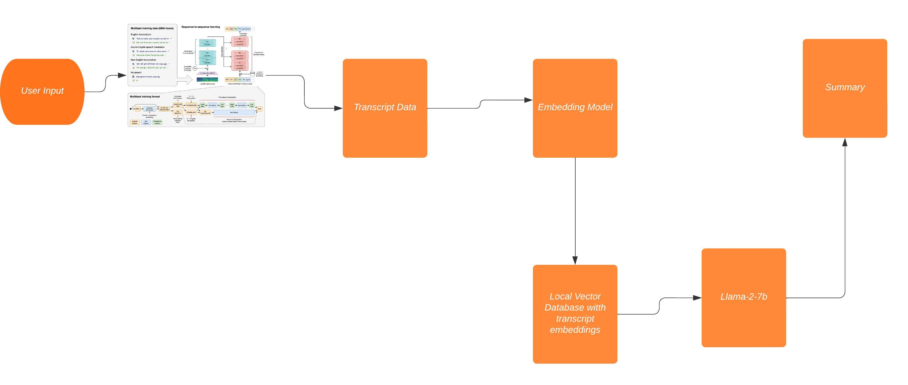

# Llama2YT -  Enhanching YT Summarization with OpenAI Whisper


## Problem Statement

Automated transcripts accompanying YouTube videos often prove inadequate in effectively conveying content due to their inaccuracies, contextual gaps, and lack of depth. This hinders content accessibility and undermines searchability. To overcome these limitations, the integration of OpenAI's Whisper with Llama-2 emerges as a promising solution for enhanced YouTube video summarization. Whisper's advanced language models combined with Llama-2's capabilities offer the potential to generate superior video transcripts that are not only more accurate but also provide deeper context and understanding. This project delves into the synergy between Whisper and Llama-2, exploring the potential of their integration to enhance YouTube video summarization.
## Project Architecture




## Project Setup

### Clone the repo
```sh
   git clone https://github.com/Siris2314/Llama2YT.git
```
### Install Required Packages
```sh
   pip install -r requirements.txt
   pip install git+https://github.com/openai/whisper.git 
```

### Download a local Llama-2-7b Model for CPU Inference here:

https://huggingface.co/TheBloke/Llama-2-7B-Chat-GGUF/tree/main

Pick any of the models and in llama-2-setup.py and replace it as shown

```py
    llm = LlamaCpp(model_path="your_model_here", temperature=0.01, n_ctx=2000, verbose=True)
```

### Run the main script
```sh
    python3 llama-2-setup.py <your_video_url> <name_of_file> <query>
```


### Changing Embedding Models

**By default the base embedding model for this project is BAAI/bge-base-en**

You can find the list of open source embeddings models and their context length here:

https://huggingface.co/spaces/mteb/leaderboard

If you want to change the embedding model, you can do so by changing the model name in the following line in the main script:

```py

    #If using Sentence-Transformer Embeddings
    embeddings = HuggingFaceEmbeddings(model_name="your_model_here",
                                        model_kwargs={'device': 'cpu'}, encode_kwargs={'normalize_embeddings': True})

    #If using BGE Embeddings
    embeddings = HuggingFaceBgeEmbeddings(model_name="your_bge_model_here",
                                        model_kwargs={'device': 'cpu'}, encode_kwargs={'normalize_embeddings': True}, bge=True)
```
The list of Langchain Embedding Support can be found here:

https://python.langchain.com/docs/integrations/text_embedding

### Experimental Methods

The experimental folder contains methods that is currently being tested or will be tested in the future.

- Map Reduce: Instead of stuffing all the context at once, we can take summarize each chunk and then get a summary of the summaries.Map Reduce uses two prompts an initial one  to summarize each chunk of data and then a different prompt to combine all of summaries into the final one. This method is being tested although it is quite computationally slow.

- Refine: Refine chain constructs a response by looping over the transcript documents and updates the response iteratively. For each document, it will pass all non-document inputs, the current document, and the latest answer to an LLM chain to generate a new answer. The benefits of this method is that you can capture more and more context as you go through the documents. This method is being tested although it is quite computationally slow.

- Pinecone Support: Testing with Pinecone will be added in the future

- Topic Summarization: You can summarize topics based on a search query in YouTube such as "How to make a cake" and then summarize the top 10 videos based on the search query.Keep in mind this does not use Whisper and relies on the YT auto subtitle generation API, so results may vary. To run this you have to run the following command:

```sh
    python3 topic-summarization.py "<your_search_query>" <your_question>
```
